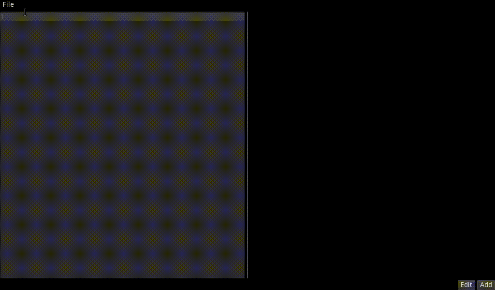
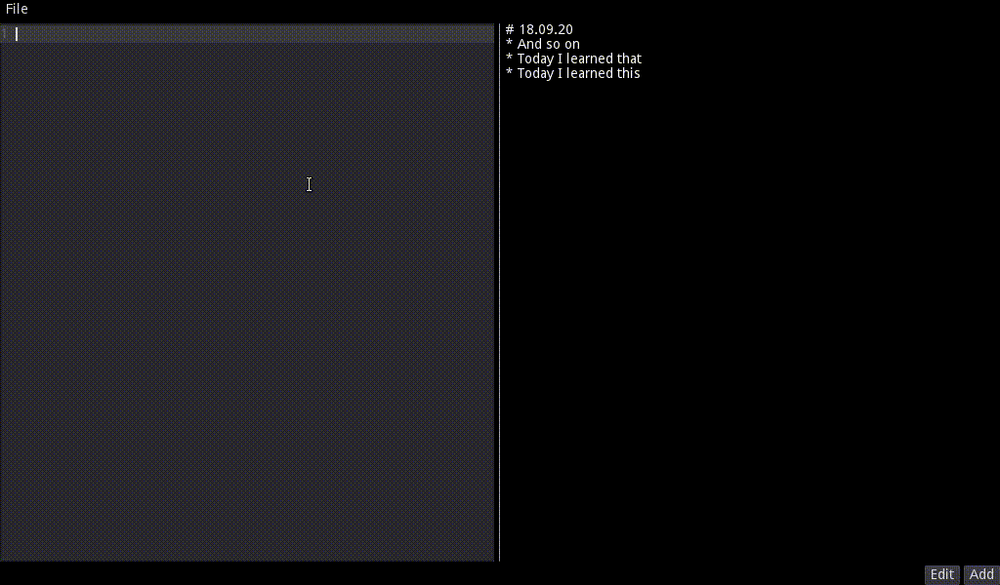

# TIL

A simple gui for tracking your daily learning while you work.

## What it does
Not much really. Choose a file and add your entries like so. The file will be used even on closing the program and reopening.

There's also some simple functionality for editing the full file if you want to, for example if you make a mistake.

## Todo

There's plenty of things to do...
* Fix linux export for releases built in CI
* Display the current open filename
* Decouple some of the functional code from the UI code
* Add keyboard shortcuts
* Make prettier